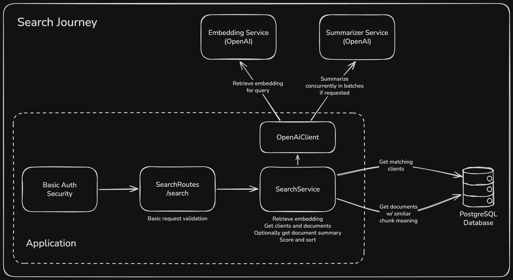

# Nevis Search API

## Tech Stack & Architecture
- This is a functional-style Kotlin stack - using http4k, JetBrains Exposed, PostgreSQL and OpenAI
- Search journey shown below (other journeys are simpler)

## Running Locally
- Create `.env` file locally, following the structure of `.env.example`
  - `OPENAI_API_KEY` is required, but `BASIC_AUTH_*` props are optional and will both default to `admin`
- Start both app and DB containers: `docker compose up --build -d`
- Seed data using `BASIC_AUTH_USERNAME=admin BASIC_AUTH_PASSWORD=admin ./gradlew seedLocalDb`
  - Update username and password if specified in `.env`
- `http://localhost:8080/status` should return 200 OK
- `http://localhost:8080/docs` should take you to Swagger docs

## Deployed Solution
- Application and PostgreSQL have been deployed on https://railway.com
- Database already seeded with data from `SeedData.kt`
- Accessible on https://nevis-search-production.up.railway.app/docs
  - Username / Password shared separately

## Testing the Application
- Go to `http://localhost:8080/docs` or https://nevis-search-production.up.railway.app/docs
- Clicking `Authorize` on Swagger allows you to specify username / password
- Assuming seed data has been loaded, the following `/search` queries should return expected results
  - `?=alice` returns single client Alice Smith
  - `?=alex` returns 3 clients, demonstrating sort order prioritization (exact match name first, etc.)
  - `?=neviswealth` return email domain matches, may also bring back document matches
  - `?=venture capital` returns single client on description match
  - `?q=JAMES` returns single client, demonstrating case-insensitivity
  - `?q=know your customer identity verification` returns 2 semantically matching documents
  - `?q=know your customer identity verification&summary=true` returns the same 2 documents with their summaries

## Search Ordering Logic
- As the search returns both clients and documents, I've come up with a scoring system to determine how to order them
- All scores are between 0.0 and 1.0
  - For clients:
    - Exact name match: `0.95`
    - Start of name match: `0.85`
    - Email substring match: `0.75`
    - Name substring match: `0.70`
    - Description substring match: `0.60`
  - For documents:
    - To ensure better results when given large documents, documents are chunked and then an embedding is stored for each chunk
    - If a document contains a chunk that is semantically close (lower cosine distance) to the query (within a configured threshold) it will be returned
    - The closer the chunk is, the higher the document containing the chunk will score
    - `1.0 - (cosineDistance / threshold)`
